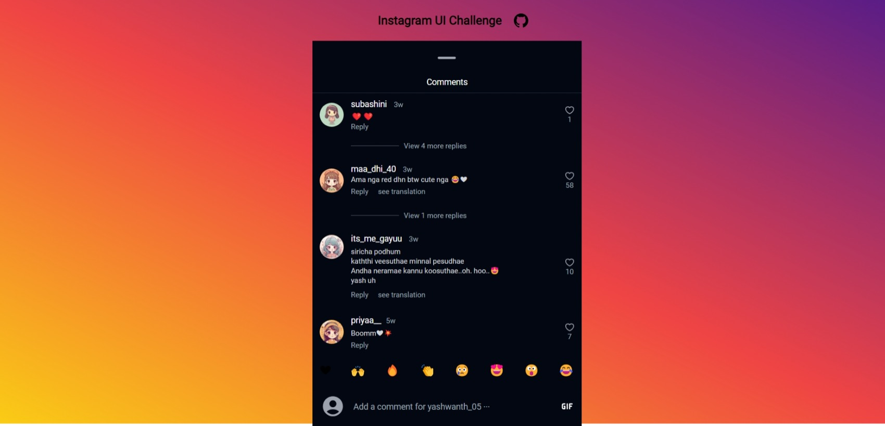

# Instagram UI Challenge By Muthu Akalya 🚀

Cyberdude Networks Pvt. Ltd Internship Project # 3 - **Instagram UI Challenge**.

## Table of Contents
- [Instagram UI Challenge By Muthu Akalya 🚀](#instagram-ui-challenge-by-Muthu-Akalya-)
  - [Table of Contents](#table-of-contents)
  - [Description](#description)
  - [Demo](#demo)
  - [Internship](#internship)
  - [Technologies Used](#technologies-used)
  - [Features](#features)
  - [Contributing](#contributing)
  - [License](#license)

## Description

This project (Instagram UI challenge) assigned by Cyberdude Networks Pvt Ltd while I'm working as an Full Stack Engineer Inten. This challenge gave me immense of confident working on UI as I wish. Check it out below **Live Link** below for your convenience. 

## Demo

✨**Live Link is Here**:https://muthuakalya.github.io/Instagram-UI-tailwind/
 
 

## Internship

This internship is provided by [CyberDude Networks Pvt. Ltd.](https://youtube.com/cyberdudenetworks) as part of the 6-Month Free Internship program, a skill development initiative organized to enhance participants' skills. Mentoring was provided by [Mr. Anbuselvan Rocky](https://instagram.com/anbuselvanrocky). For more information, [you can contact CyberDude Networks here](https://cyberdudenetworks.com).

## Technologies Used

HTML 5 | Tailwind CSS | Vite

## Features

- Visually appealing UI
- Status rings.
- Dark & light variant
- Comments section 

## Contributing

Feel free to contribute to this project by "Forking" this repo, and Add a PR for any additional features that can be added this UI Challenge. 

## License

MIT

## Acknowledgments

I would like to thank [Mr.Shajid Shafee](https://github.com/mshajid) for helping me to deploy this project into github pages.

<!-- | Resources | Links |
|--|--|
| Color Pallet | colorhunt.co | --> 

---

  

